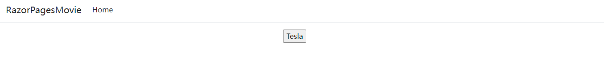
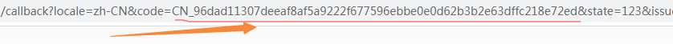
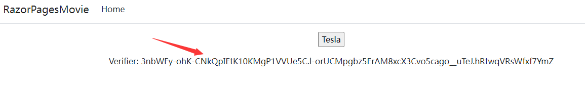
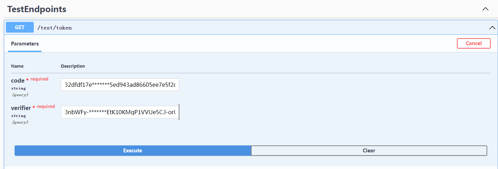

# Tesla

This repository is for implementing some functionalities related to Tesla.
Updates will be made based on mood.

Currently, only Web and Tesla.Sdk projects have content, and the others are empty projects

## Service State

[](https://github.com/futugyou/TeslaProject/actions/workflows/github-code-scanning/codeql)
[](https://github.com/futugyou/TeslaProject/actions/workflows/dependabot-auto.yml)
[](https://github.com/futugyou/TeslaProject/actions/workflows/dependabot/dependabot-updates)
[](https://github.com/futugyou/TeslaProject/actions/workflows/markdownlint.yml)
[](https://dl.circleci.com/status-badge/redirect/gh/futugyou/TeslaProject/tree/master)

## doc

1. [overview](./doc/01.architecture.md)
2. [vehicle state](./doc/02.vehicle-state.md)
3. [websocket](./doc/03.streaming.md)

## dev

1. redirect to tesla, and login

    
    

2. copy the code

    

3. copy the verifier code

    

4. call token endpoint with code and verifier

    

## run

- docker

    ```ps
    docker build -f src/Web/TeslaApi.Web/Dockerfile .
    ```

- docker compose

    ```ps
    docker-compose -f ./docker-compose.debug.yml up
    ```

- aspire demo, Note: It is not appropriate to use aspire at present,

    ```ps
    dotnet run --project ./src/Tesla.AppHost/
    ```

## reference

- [timdorr](https://tesla-api.timdorr.com/)
- [teslamate](https://docs.teslamate.org/)
- [garnet](https://microsoft.github.io/garnet/docs)
